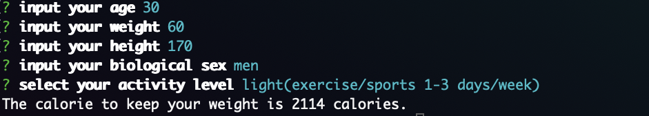

tdee_calculator
===============

this is tdee_calculator

[](https://oclif.io)
[](https://npmjs.org/package/tdee_calculator)
[](https://npmjs.org/package/tdee_calculator)
[](https://github.com/saba-can00/tdee_calculator/blob/master/package.json)

<!-- toc -->
* [Usage](#usage)
* [Commands](#commands)
<!-- tocstop -->
# Usage
<!-- usage -->
This is TDEE calculator to calculate the calorie to keep your current weight.

```sh-session
install
$ npm install -g tdee_calculator

run
$ /tdee_calculator/bin/run 

help
$ tdee_calculator --help
```

## Execution 

After execute command, input the parameter to calculate.
Then you can get the calorie to keep your current weight.




# OPTIONS
```sh-session
  -H, --help                         show CLI help
  -a, --age=age                      input your age
  -h, --height=height                input your height
  -l, --activityLevel=activityLevel  input your daily activity level 
  -s, --sex=sex                      input your biological sex (men or women)
  -v, --version                      show CLI version
  -w, --weight=weight                input your weight
```
<!-- usagestop -->